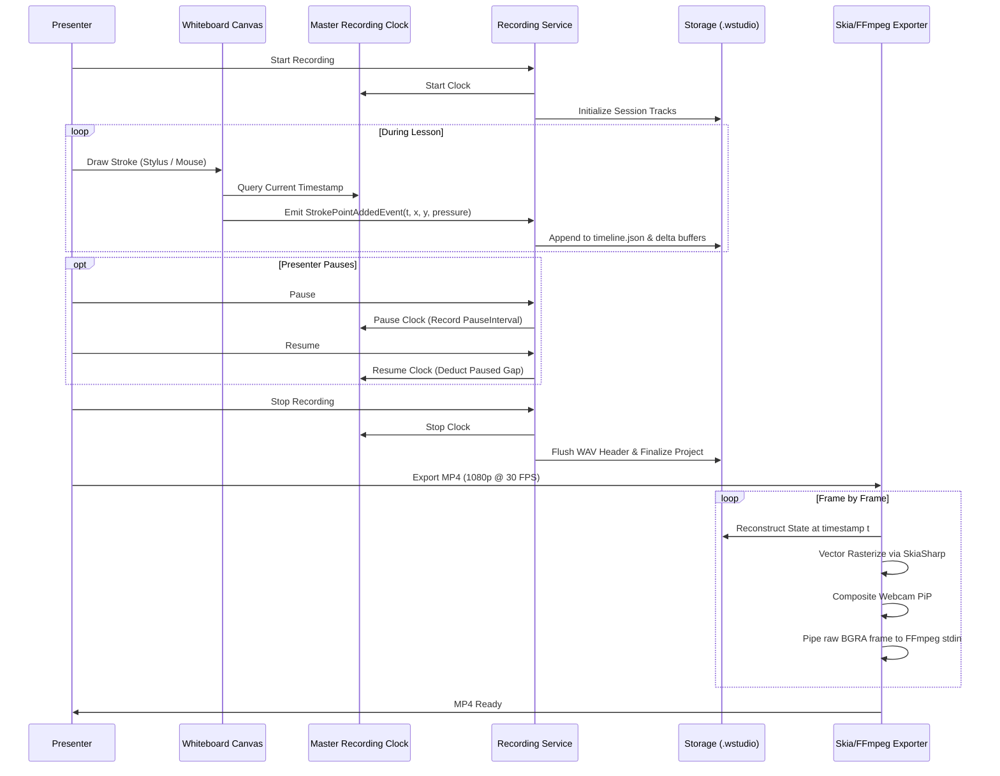

# WriteStudio Architecture & Technical Specification

## 1. Core Architectural Principle

WriteStudio is engineered around the principle: **"Present privately, record selectively."**

Traditional lecture recorders grab the entire screen buffer, creating risk of accidental disclosure of confidential presenter notes, student rosters, or slide answers.

In WriteStudio:
- The **Presenter Workspace** contains reference slides (PDF/Images), slide navigator, and tool selectors.
- The **Recording Output** contains discrete, explicitly multiplexed layers (vector whiteboard strokes, microphone audio, optional webcam picture-in-picture).
- The reference material is physically decoupled from the rendering pipeline.

---

## 2. Layer & Timeline Synchronization Pipeline



---

## 3. Data Formats & Project Bundle (`.wstudio`)

A `.wstudio` project package contains:

| File / Folder | Content Description |
| :--- | :--- |
| `project.json` | Project metadata (Title, Author, Created/Modified dates, Canvas size, FPS). |
| `timeline.json` | Chronological polymorphic timeline events with synchronized timestamps. |
| `strokes/page_{n}.json` | Complete vector stroke collections for each whiteboard page. |
| `audio/recording.wav` | 48kHz 16-bit PCM synchronized microphone audio track. |
| `video/webcam.mp4` | Synchronized webcam video feed (when webcam recording is enabled). |
| `slides/` | Cached presenter reference documents. |
| `exports/` | Exported MP4 master videos. |

---

## 4. Vector Stroke Modeling

Rather than storing bitmaps, strokes are modeled as continuous vector chains:

```csharp
public class DrawingStroke
{
    public Guid Id { get; set; }
    public int PageIndex { get; set; }
    public TimeSpan StartTime { get; set; }
    public TimeSpan EndTime { get; set; }
    public ColorInfo Color { get; set; }
    public double Thickness { get; set; }
    public double Opacity { get; set; }
    public StrokeToolType ToolType { get; set; }
    public List<DrawingPoint> Points { get; set; }
}

public record DrawingPoint(double X, double Y, float Pressure, TimeSpan Timestamp);
```

This ensures resolution independence: a lecture recorded on an ordinary tablet can be exported at native 4K UHD with ultra-crisp lines and typography.
