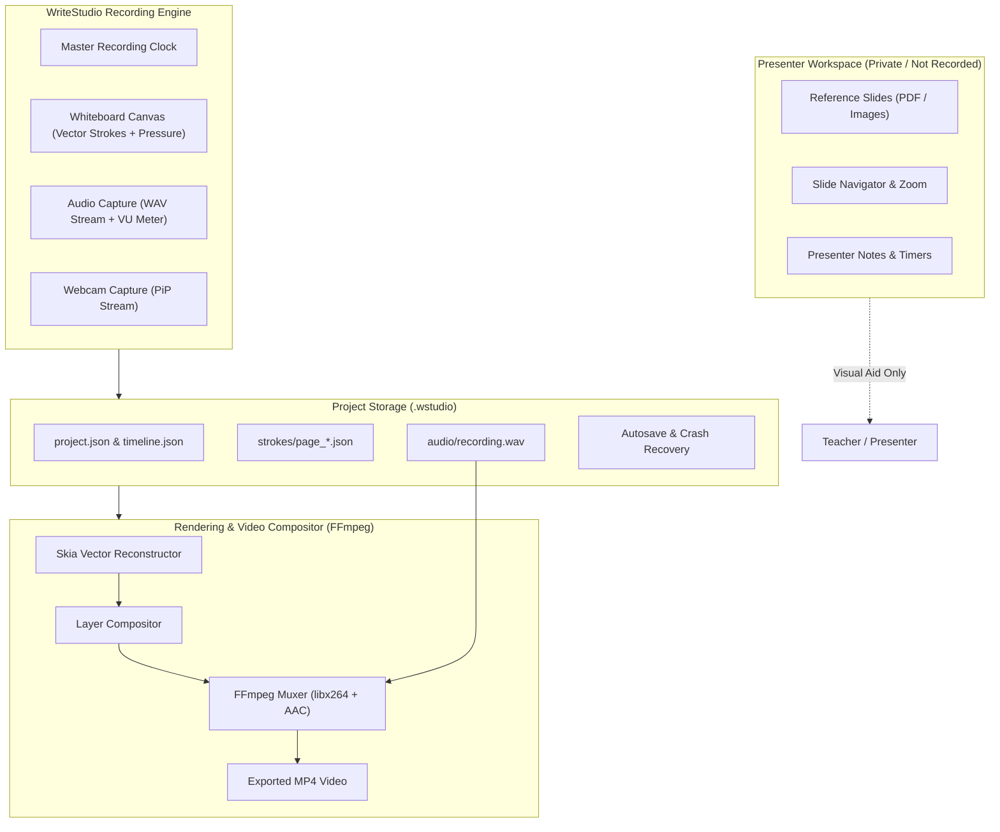

# WriteStudio — .NET Teaching & Handwritten Video Recording Studio

[](https://dotnet.microsoft.com/)
[](LICENSE)
[]()

> **"Present privately, record selectively."**

**WriteStudio** is a desktop teaching, lecturing, and handwritten recording studio built in C# and .NET 10. Designed for educators, trainers, engineers, and creators, WriteStudio pairs a pressure-sensitive virtual whiteboard with discrete multi-layer recording (audio, drawing, webcam PiP), while ensuring presenter reference documents (PDFs, notes, slides) stay strictly confidential and never leak into the final recording.

---

## 🌟 Key Highlights

* **🔒 Strict Presenter Privacy Barrier**: Reference slides/PDFs are displayed exclusively in the presenter workspace and isolated from the output recording pipeline.
* **✍️ High-Precision Vector Whiteboard**: Captures continuous strokes with pressure sensitivity (0.0–1.0), timestamps, and tools (Pen, Pencil, Highlighter, Eraser, Geometric Shapes, Text).
* **⏱️ Timeline-Driven Recording Engine**: Not a crude screen recorder. Events and tracks synchronize against a unified master clock with flawless pause/resume compensation.
* **🎙️ Real-Time Audio Metering**: Live Peak, RMS, and Decibel VU monitoring with automatic USB microphone detection and disconnect protection.
* **📹 Webcam Picture-in-Picture**: Customizable camera overlays with presets (Bottom-Right, Bottom-Left, Top-Right, Top-Left, Fullscreen, Hidden) and mirror mode.
* **🎬 SkiaSharp + FFmpeg Rendering**: Offline vector frame reconstruction exporting crisp MP4 video at 1080p / 720p / 4K @ 30/60 FPS.
* **💾 Native `.wstudio` Projects & Crash Recovery**: Continuous heartbeat autosave ensuring long lecture recordings can be restored if an unexpected interruption occurs.

---

## 📐 Architecture Overview



---

## 📁 Solution Structure

```
WriteStudio.sln
├── src/
│   ├── WriteStudio.Core/           # Core models, interfaces, timeline events, recording clock
│   ├── WriteStudio.Whiteboard/     # Stylus/mouse input, stroke geometry, undo/redo, page manager
│   ├── WriteStudio.Audio/          # Audio capture, device enumeration, VU meter level calculator
│   ├── WriteStudio.Camera/         # Webcam capture, mirror mode, PiP layout presets
│   ├── WriteStudio.Slides/         # PDF/image reference loader, private presenter slide viewer
│   ├── WriteStudio.Recording/      # Recording session coordinator, pause/resume timeline math
│   ├── WriteStudio.Rendering/      # SkiaSharp vector rasterizer, FFmpeg pipe orchestrator
│   ├── WriteStudio.Storage/        # .wstudio bundle serializer, autosave, crash recovery manager
│   └── WriteStudio.App/            # WPF desktop UI, MVVM ViewModels, Dependency Injection
└── tests/
    ├── WriteStudio.Core.Tests/       # Domain & timeline clock tests
    ├── WriteStudio.Whiteboard.Tests/ # Stroke math, eraser hit testing, undo/redo tests
    ├── WriteStudio.Recording.Tests/  # Session lifecycle & synchronization tests
    ├── WriteStudio.Rendering.Tests/  # Frame reconstruction & FFmpeg CLI builder tests
    └── WriteStudio.Storage.Tests/    # Project save/load & package export tests
```

---

## 🚀 Quick Start

### Prerequisites
1. [.NET 10 SDK](https://dotnet.microsoft.com/download)
2. [FFmpeg](https://ffmpeg.org/download.html) (available on system PATH)

### Build and Run Tests
```bash
# Clone the repository
git clone https://github.com/shatru123/WriteStudio.git
cd WriteStudio

# Build entire solution
dotnet build

# Run unit tests
dotnet test
```

### Launch the Application (Windows Desktop)
```bash
dotnet run --project src/WriteStudio.App/WriteStudio.App.csproj
```

---

## 📜 License

This project is licensed under the [MIT License](LICENSE).
